#### Top favorited post for day 13 `#30DayMapChallenge2021 (Data Challenge 2 : Natural Earth)`

| media | user | 
|-------|------|
| 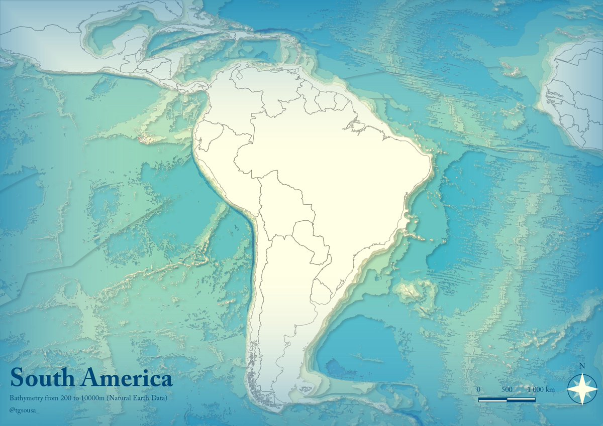 |[@tgsousa_](https://twitter.com/tgsousa_/status/1459572463675793415)|
| 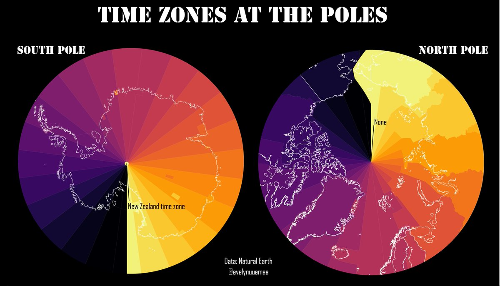 |[@evelynuuemaa](https://twitter.com/evelynuuemaa/status/1459415621255544832)|
| 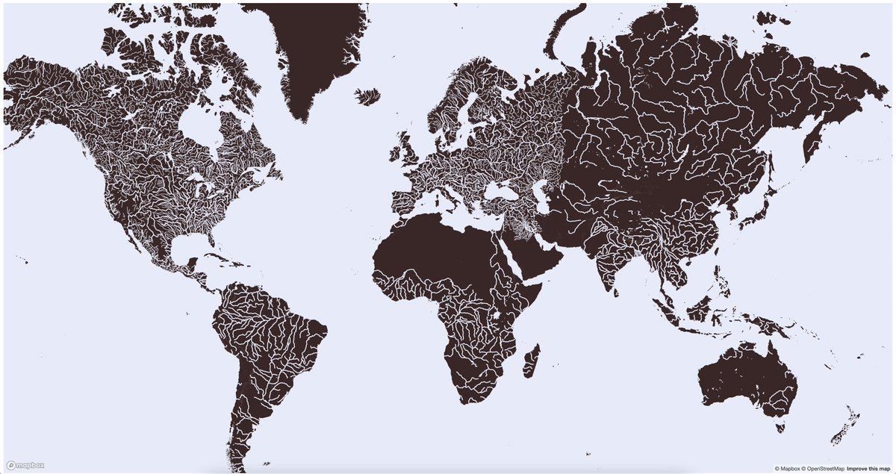 |[@Reyfenberg](https://twitter.com/Reyfenberg/status/1459543497934086145)|
| 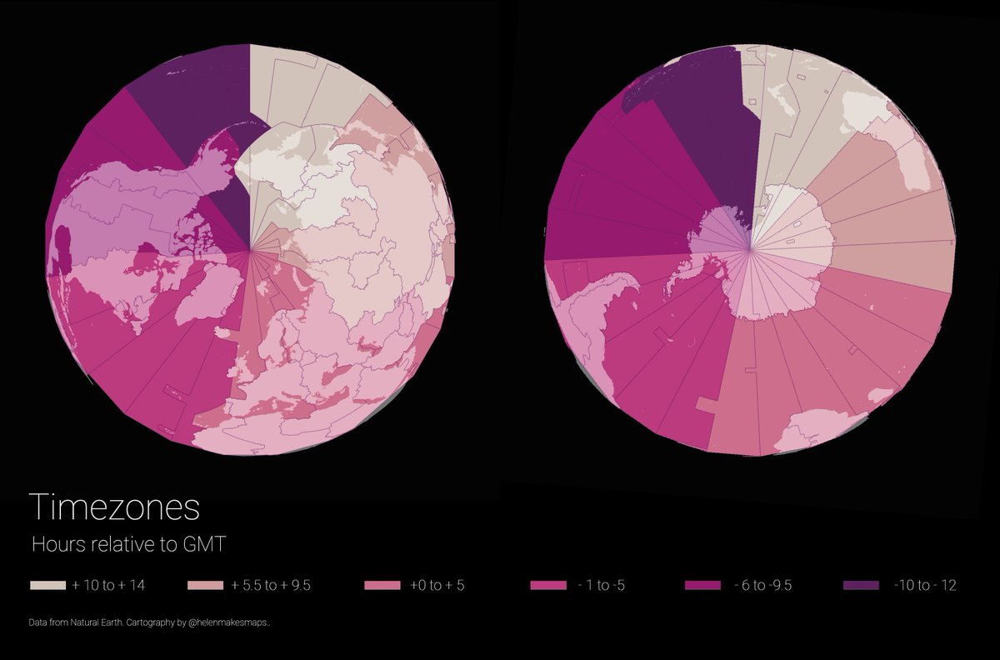 |[@helenmakesmaps](https://twitter.com/helenmakesmaps/status/1459498440132595721)|
| 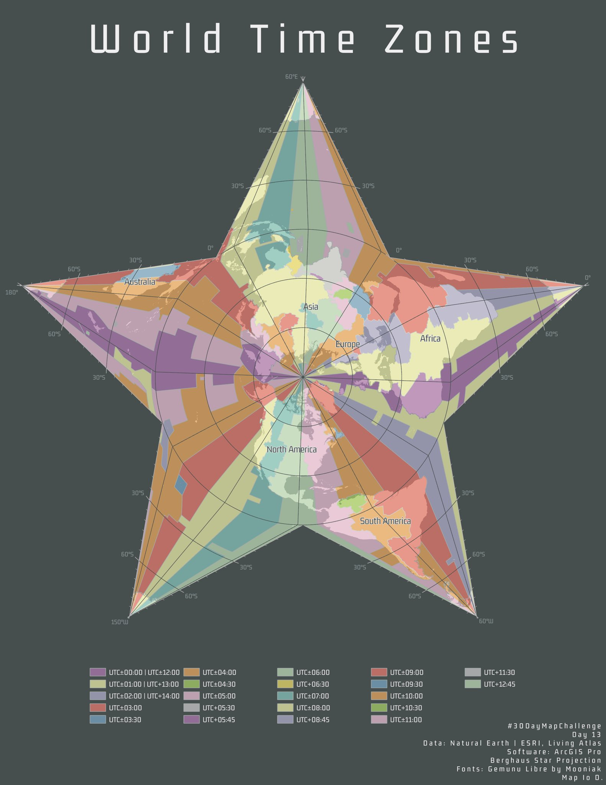 |[@ioddg](https://twitter.com/ioddg/status/1459630324628000773)|
| 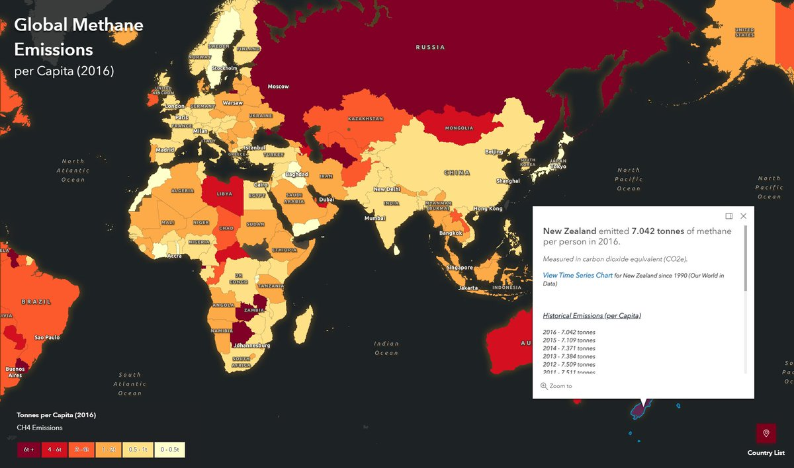 |[@andrewdc_nz](https://twitter.com/andrewdc_nz/status/1459442748839194624)|
| 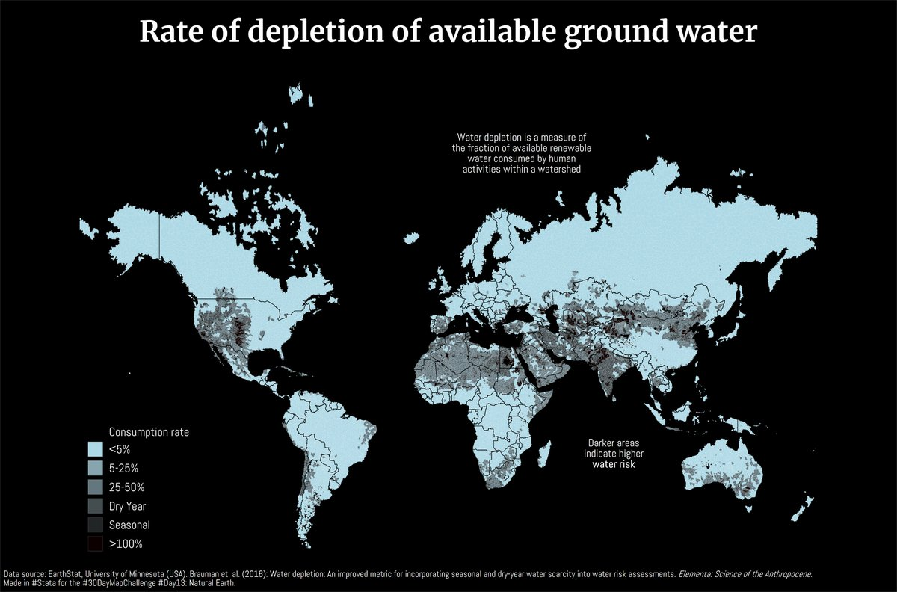 |[@AsjadNaqvi](https://twitter.com/AsjadNaqvi/status/1459465464560685061)|
| 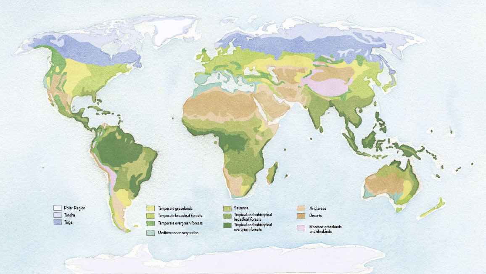 |[@odilon72](https://twitter.com/odilon72/status/1459435844972994563)|
|  |[@StaridasGeo](https://twitter.com/StaridasGeo/status/1459499608644767753)|
| 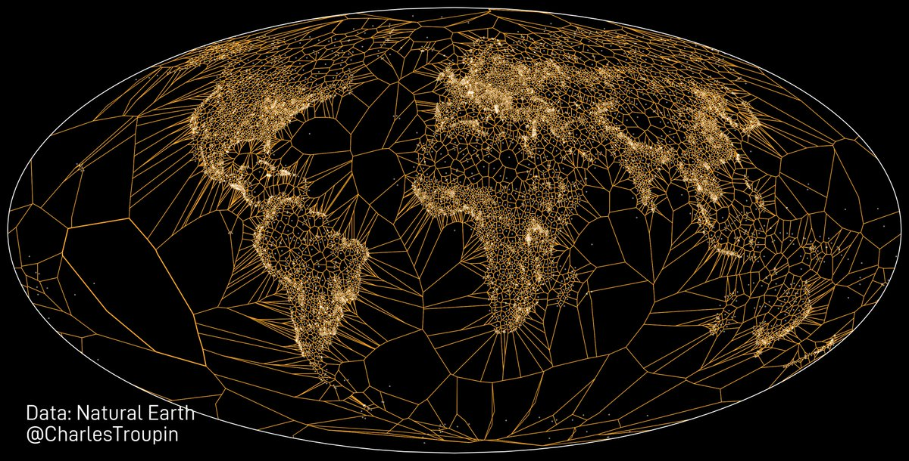 |[@CharlesTroupin](https://twitter.com/CharlesTroupin/status/1459591151321767939)|
| 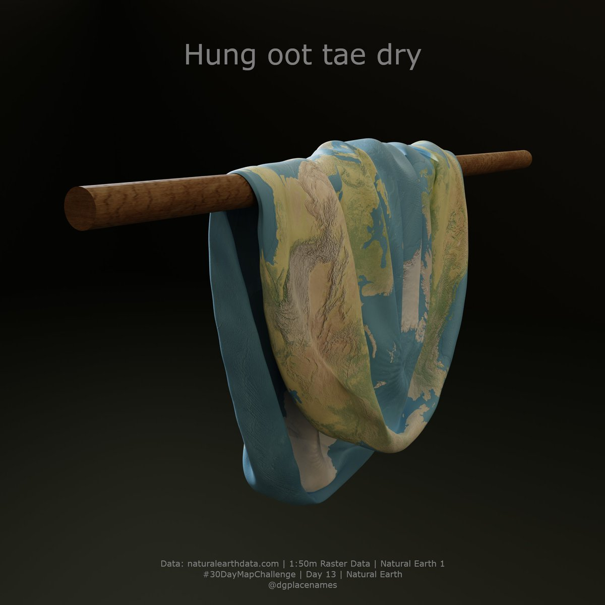 |[@dgplacenames](https://twitter.com/dgplacenames/status/1459511204423086082)|
| 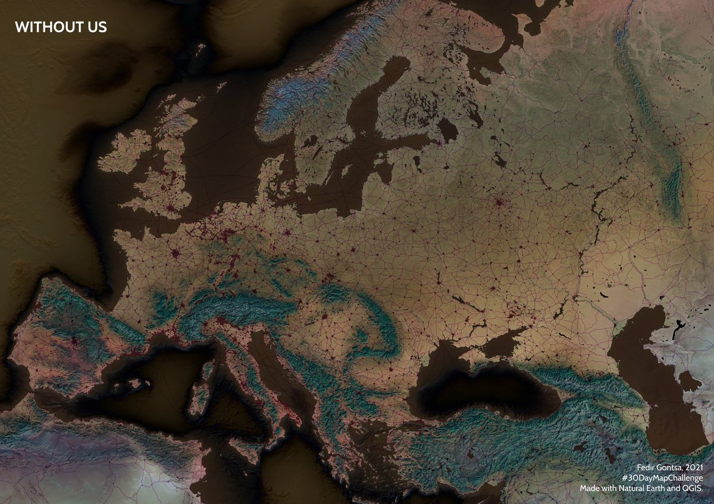 |[@gontsa](https://twitter.com/gontsa/status/1459617768651857924)|
