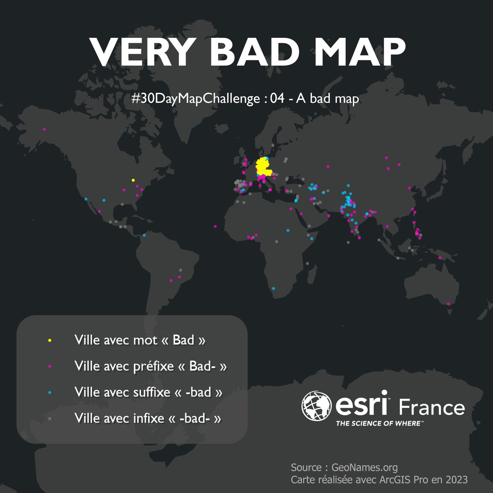

#### Top favorited post for day 04 `#30DayMapChallenge2023 (A bad map)`

| media | user | trigramme |
|-------|------|-----------|
||[@flocheprl](https://twitter.com/flocheprl/status/1720768897043820922)|  |
||[@LucasDestrem](https://twitter.com/LucasDestrem/status/1720721328938868974)|  |
||[@229Biodiversity](https://twitter.com/229Biodiversity/status/1720718433417896386)|  |
||[@Lea_Des](https://twitter.com/Lea_Des/status/1720715504267165918)|  |
||[@jmviglino](https://twitter.com/jmviglino/status/1720698643161002430)|  |
||[@Esri_France](https://twitter.com/Esri_France/status/1720757786324111369)|  |
||[@CanGeoReader](https://twitter.com/CanGeoReader/status/1720787449914277974)|  |
||[@DevinMLea](https://twitter.com/DevinMLea/status/1720799733831139610)|  |
||[@BlakeRobMills](https://twitter.com/BlakeRobMills/status/1720953406817210514)|  |
||[@Anna81020749](https://twitter.com/Anna81020749/status/1720949987171819766)|  |